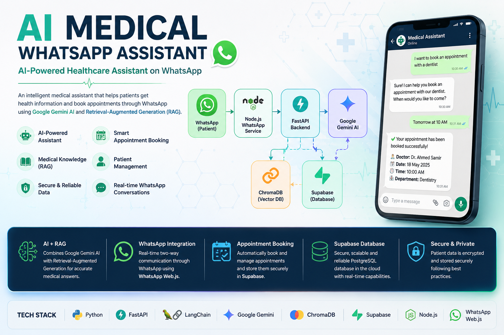
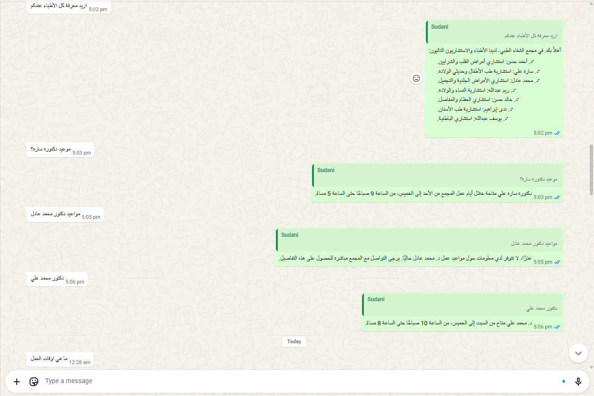
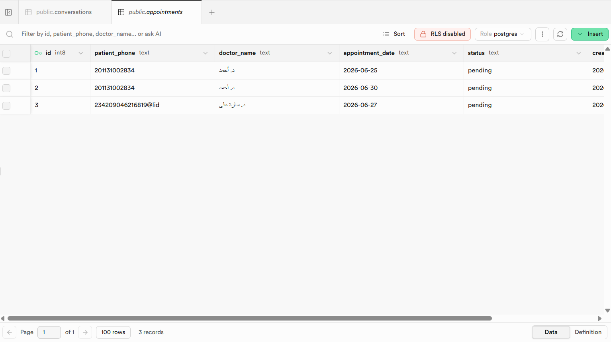
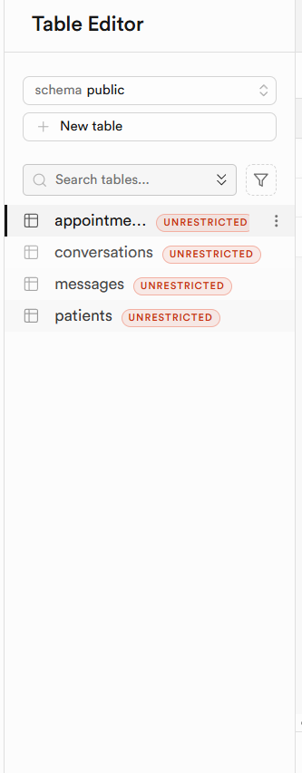

# 🩺 AI Medical WhatsApp Assistant

<p align="center">
  
</p>


An AI-powered medical assistant that enables patients to communicate with a healthcare center directly through WhatsApp.

The system uses Google's Gemini AI together with Retrieval-Augmented Generation (RAG) to answer patient questions, provide healthcare information, and book appointments automatically.

---

# Features

- 🤖 AI-powered medical assistant
- 💬 WhatsApp integration
- 🧠 Google Gemini AI
- 📚 Retrieval-Augmented Generation (RAG)
- 📅 Appointment booking
- 👤 Patient management
- 🏥 Medical knowledge base
- 💾 Supabase database
- ⚡ FastAPI backend
- 🔍 Conversation history

---

# Tech Stack


| Category | Technologies |
|----------|--------------|
| Backend | Python, FastAPI |
| AI | Google Gemini, LangChain |
| Vector Database | ChromaDB |
| Database | Supabase |
| Messaging | Node.js, WhatsApp Web.js |

---

# Project Structure

```
medical-ai-whatsapp-agent/

├── agent-service/
│   ├── agent/
│   ├── app/
│   ├── rag/
│   ├── tools/
│   ├── schemas/
│   ├── knowledge/
│   └── requirements.txt
│
├── whatsapp-service/
│   ├── index.js
│   ├── package.json
│   └── package-lock.json
│
└── README.md
```

---

# System Workflow

1. Patient sends a WhatsApp message.
2. WhatsApp Service receives the message.
3. FastAPI backend processes the request.
4. RAG retrieves medical knowledge.
5. Gemini AI generates a response.
6. Patient receives the answer instantly.
7. If needed, an appointment is automatically created and stored in Supabase.

---

# Installation

## Clone the repository

```bash
git clone https://github.com/amgadnazar/medical-ai-whatsapp-agent.git
```

## Backend

```bash
cd agent-service

pip install -r requirements.txt
```

Run

```bash
uvicorn app.main:app --reload
```

---

## WhatsApp Service

```bash
cd whatsapp-service

npm install

node index.js
```

---


# API Documentation

The backend is built using **FastAPI** and exposes RESTful APIs for patient management, AI chat, and appointment booking.

## Available Endpoints

| Method | Endpoint | Description |
|--------|----------|-------------|
| GET | `/` | Health check endpoint |
| POST | `/chat` | Send a message to the AI assistant |
| POST | `/patient` | Create a new patient |
| POST | `/appointment` | Create a new appointment |

---

## Base URL

```
http://localhost:8000
```

---

## Health Check

Returns the API status.

### Request

```http
GET /
```

### Response

```json
{
  "status": "running"
}
```

---

## AI Chat

Send a patient message to the AI assistant.

### Request

```http
POST /chat
```

### Body

```json
{
  "phone": "+201234567890",
  "text": "I want to book an appointment with a dentist."
}
```

### Response

```json
{
  "reply": "Your appointment has been booked successfully."
}
```

---

## Create Patient

Creates a new patient record.

### Request

```http
POST /patient
```

### Body

```json
{
  "phone": "+201234567890",
  "name": "John Doe",
  "age": 28,
  "gender": "Male"
}
```

### Response

```json
{
  "message": "Patient created successfully"
}
```

---

## Create Appointment

Creates a new appointment manually.

### Request

```http
POST /appointment
```

### Body

```json
{
  "patient_phone": "+201234567890",
  "doctor_name": "Dr. Ahmed",
  "appointment_date": "2026-06-30 10:00"
}
```

### Response

```json
{
  "message": "Appointment created successfully"
}
```

---

## Interactive API Documentation

After running the FastAPI server, open:

```
http://localhost:8000/docs
```

FastAPI automatically generates an interactive Swagger UI where you can test every endpoint directly from your browser.

---

# Environment Variables

## Required Environment Variables

| Variable | Description |
|----------|-------------|
| GEMINI_API_KEY | Google Gemini API key |
| SUPABASE_URL | Supabase project URL |
| SUPABASE_KEY | Supabase service key |
| MODEL_NAME | Gemini model name |

---

# Screenshots

## WhatsApp Conversation

<p align="center">
  
</p>

---

## Appointment Booking

<p align="center">
  
</p>

---

## Supabase Database

<p align="center">
  
</p>

# System Architecture

<p align="center">
    
</p>

# Future Improvements

- Voice messages
- Arabic speech recognition
- Doctor dashboard
- Patient dashboard
- Docker deployment
- Cloud deployment
- Multi-language support

---

# Author

**Amgad Nazar**

[](https://github.com/amgadnazar)
[](https://linkedin.com/in/amjad-nazar)
[](https://amgadnazar.github.io)